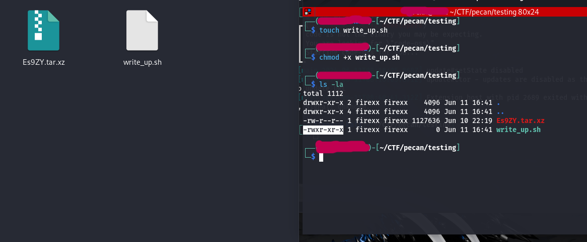
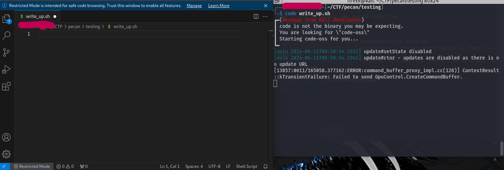
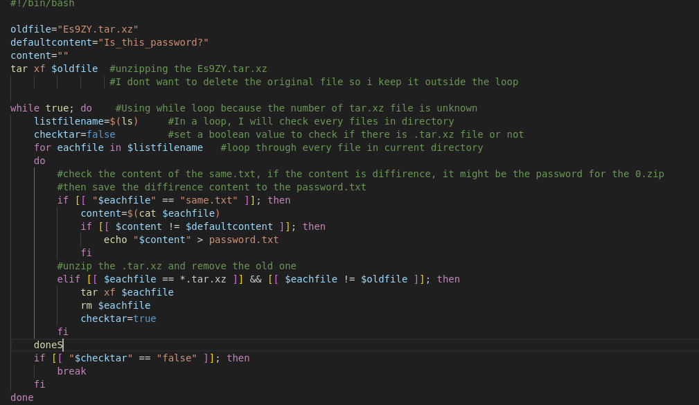
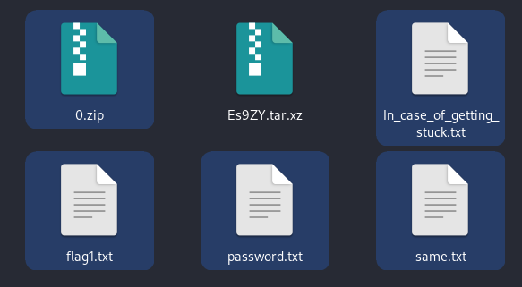

At first, you will receive a ZIP file named "Es9ZY.tar.xz". If you try to unzip the file manually, you'll receive a new ZIP file with a random name and a file called "same.txt". The content of this file is "Is_this_password?". Hmm, that's suspicious! However, if you keep unzipping the files, you'll still get the same result. This process seems endless. Therefore, using a script is a good idea in this situation. In this write-up, I will use the Bash language to address this challenge.

Step 1: Let's create a bash file in the challenge’s directory, using these commands:
touch youfilename.sh
chmod +x yourfilename.sh
code yourfilename.sh
The chmod +x command grants execute permission to your newly created file. Therefore, you can run your script on Linux. You should perform this step every time you create a new script.

You can edit the script using editors like nano or vim. I prefer using VScode for editing scripts.  To open the script in VScode, simply type code yourfilename.sh. VScode will open the script for editing.
If you haven't installed VScode on your virtual machine yet, you can follow the installation guide from the terminal.

Step2: Coding
This code has two main functions. The first function is to automatically unzip all files with theextension ".tar.xz". The second function is to compare the content in every "same.txt" file. If there is content that is different from the others, the script will write it to a new file called "password.txt".

Step3: Run the script. In your terminal, type this command “./yourfilename.sh”
After unzip processing. You will receive these new files:

The first flag will be in flag1.txt
