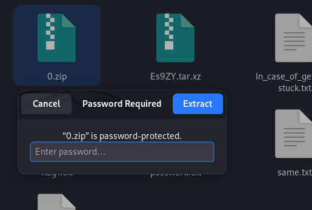

If you unzip the 0.zip (which contains the last flag), it will require a password

You can find the password in password.txt (which is created by our script from AutomaTar 1)
“1s_this_password?”

With this password, now you can unzip the 0.zip file and obtain the final flag in flag.txt
